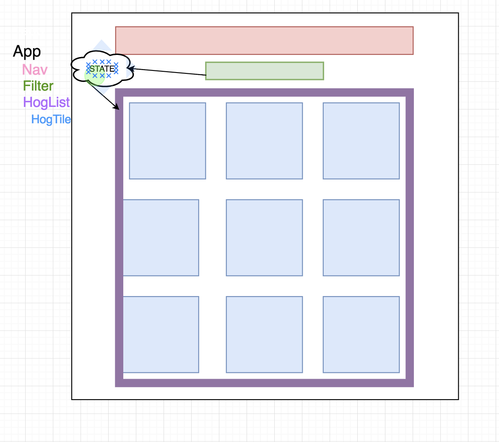

# Hogwarts: The React app for fans of prize-winning pigs

## React Week 1 Project

## Project goals:

1.  Create an index displaying all hog tiles
2.  Render each hog name and picture in a tile
3.  Show the hog's details upon a user's click
4.  Allow users to sort the hogs based on name and weight
5.  Filter the hogs that are greased

## Project requirements:

* functional and container components (at least one of each, likely you'll have several of each)
* components using state and props
* re-renders based on client-side events

## What we have so far:

* File containing all our hog data imported into App.js
* Folder of hog images
* App.js rendering Nav , Filter , and HogList components
* App passing hogs as a prop to HogList

React thinking:
1)Come in with static components and mock drawing

2)start thinking about data:

App.js -->
Primary stateful component, greased and sortType
-sorts by greased (filter)
-sorts by sortType (name, weight: sort())
name: return a.name < b.name ? -1 : a.name > b.name ? 1 : 0;
weight: return b[weight] - a[weight]
render nav, filter and List

HogList.js -->
-Map over the sorted hogs array (coming in as props from App)
-Render a HogTile for each hog in array(don't forget unique keys!)
-pass hog object to HogTile as props

HogTile.js -->

-Needs local state to track if its been clicked
-Gets its own image (getImage function)
conditional render with maxPigTile or minPigTile based on clicked state

Filter.js -->
-Recieves 'setSortType' and 'toggleGreased' as props
-has checkbox and collection select
