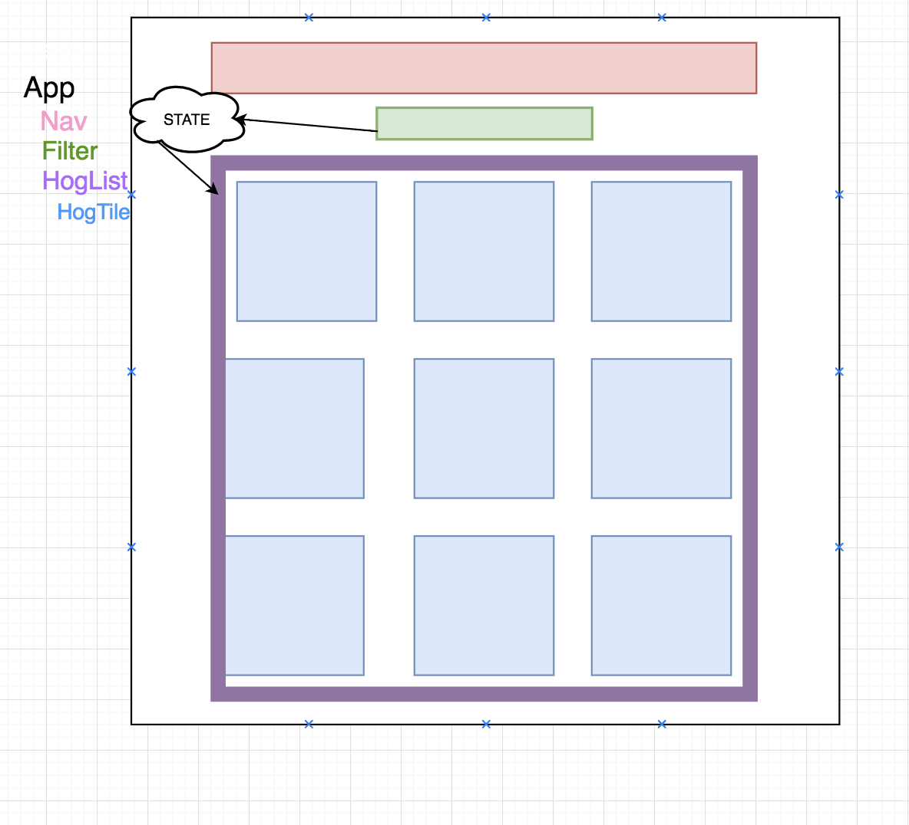

# Hogwarts: The React app for fans of prize-winning pigs

## React Week 1 Project

## Project goals:

1.  Create an index displaying all hog tiles ✅
2.  Render each hog name and picture in a tile ✅
3.  Show the hog's details upon a user's click
4.  Allow users to sort the hogs based on name and weight
5.  Filter the hogs that are greased

## Project requirements:

* functional and container components (at least one of each, likely you'll have several of each)
* components using state and props
* re-renders based on client-side events

## What we have so far:

* File containing all our hog data imported into App.js
* Folder of hog images
* App.js rendering Nav , Filter , and HogList components
* App passing hogs as a prop to HogList
* HogList mapping through hogs and rendering HogTiles for each hog object

  1)Static components and mock drawing:

2)Data and Data Flow:

App.js -->

* Primary stateful component
* state structure: { greased: boolean, sortType: string }
* As state changes, array of hogs passed down to HogList will change
* How do we get the app's state to change when filter changes or greased is checked/unchecked?

Filter.js -->

* has dropdown for filter type
* has checkbox for greased vs ungreased
* how do we get the changes on the filter component to the hoglist component?

HogList.js -->

* probably just a container component
* Maps over the sorted hogs array (coming in as props from App)
* Renders a HogTile for each hog in array (don't forget unique keys!)
* pass hog object to HogTile as props

HogTile.js -->

* class based component so that it can get its own image (getImage function)
* how will get the additional details to display on a user's click?
